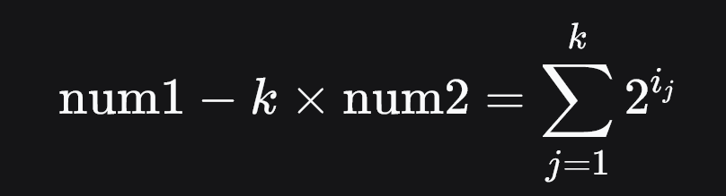

2749\. Minimum Operations to Make the Integer Zero

**Difficulty:** Medium

**Topics:** `Bit Manipulation`, `Brainteaser`, `Enumeration`, `Weekly Contest 351`

You are given two integers `num1` and `num2`.

In one operation, you can choose integer `i` in the range `[0, 60]` and subtract <code>2<sup>i</sup> + num2</code> from `num1`.

Return _the integer denoting the **minimum** number of operations needed to make `num1` equal to `0`_.

If it is impossible to make `num1` equal to `0`, return `-1`.

**Example 1:**

- **Input:** num1 = 3, num2 = -2
- **Output:** 3
- **Explanation:** We can make 3 equal to 0 with the following operations:
  - We choose i = 2 and subtract 22 + (-2) from 3, 3 - (4 + (-2)) = 1.
  - We choose i = 2 and subtract 22 + (-2) from 1, 1 - (4 + (-2)) = -1.
  - We choose i = 0 and subtract 20 + (-2) from -1, (-1) - (1 + (-2)) = 0.
    It can be proven, that 3 is the minimum number of operations that we need to perform.

**Example 2:**

- **Input:** num1 = 5, num2 = 7
- **Output:** -1
- **Explanation:** It can be proven, that it is impossible to make 5 equal to 0 with the given operation.

**Constraints:**

- <code>1 <= num1 <= 10<sup>9</sup></code>
- <code>-10<sup>9</sup> <= num2 <= 10<sup>9</sup></code>


**Hint:**
1. If we want to make integer n equal to 0 by only subtracting powers of 2 from n, in how many operations can we achieve it?
2. We need at least - the number of bits in the binary representation of n, and at most - n.
3. Notice that, if it is possible to make num1 equal to 0, then we need at most 60 operations.
4. Iterate on the number of operations.


**Similar Questions:**
1. [991. Broken Calculator](https://github.com/mah-shamim/leet-code-in-php/tree/main/algorithms/000991-broken-calculator)
2. [1658. Minimum Operations to Reduce X to Zero](https://github.com/mah-shamim/leet-code-in-php/tree/main/algorithms/001658-minimum-operations-to-reduce-x-to-zero)


**Solution:**

We need to determine the minimum number of operations required to reduce the integer `num1` to zero by repeatedly subtracting values of the form _**2<sup>i</sup> + num2**_ for some integer `i` between 0 and 60. If it is impossible to achieve zero, we return -1.

### Approach
1. **Problem Analysis**: The key insight is that each operation subtracts _**2<sup>i</sup> + num2**_ from `num1`. After `k` operations, the total subtracted amount is _**k x num2**_ plus the sum of `k` powers of two. Therefore, the equation becomes:
    
   where each _**i<sub>j</sub>**_ is between 0 and 60.

2. **Key Insight**: The right-hand side of the equation is the sum of `k` powers of two. For the equation to hold, the value _**S = num1 - k x num2**_ must be non-negative and at least `k` (since the smallest sum of `k` powers of two is `k` ones). Additionally, the number of set bits (popcount) in the binary representation of `S` must be less than or equal to `k`. This is because each set bit in `S` represents a power of two that must be included in the sum, and we can break larger powers into smaller ones to increase the number of terms if needed.

3. **Algorithm Selection**: Iterate over possible values of `k` from 1 to 60. For each `k`, compute `S = num1 - k * num2`. If `S` is less than `k`, skip. Otherwise, calculate the number of set bits in `S`. If the number of set bits is at most `k`, return `k` as the solution. If no valid `k` is found after checking all possibilities, return -1.

Let's implement this solution in PHP: **[2749. Minimum Operations to Make the Integer Zero](https://github.com/mah-shamim/leet-code-in-php/tree/main/algorithms/002749-minimum-operations-to-make-the-integer-zero/solution.php)**

```php
<?php
/**
 * @param Integer $num1
 * @param Integer $num2
 * @return Integer
 */
function makeTheIntegerZero($num1, $num2) {
    ...
    ...
    ...
    /**
     * go to ./solution.php
     */
}

// Test cases
echo makeTheIntegerZero(3, -2) . "\n";  // Output: 3
echo makeTheIntegerZero(5, 7) . "\n";   // Output: -1?>
```

### Explanation:

1. **Iteration**: The loop checks all possible values of `k` from 1 to 60, as it is known that beyond 60 operations, the solution is either found or impossible.
2. **Check Feasibility**: For each `k`, compute `S` which represents the total sum of powers of two needed. If `S` is less than `k`, it means even the smallest sum of `k` ones would exceed `S`, making it impossible.
3. **Popcount Check**: Calculate the number of set bits in `S`. This count represents the minimal number of distinct powers of two needed to sum to `S`. If this count is within `k`, then `S` can be expressed as the sum of `k` powers of two by breaking larger powers into smaller ones.
4. **Result**: If a valid `k` is found, return it immediately. If no valid `k` is found after checking all possibilities, return -1.

This approach efficiently checks all possible solutions within the constraints by leveraging bit manipulation and simple arithmetic operations. The complexity is linear with respect to the number of operations checked, making it optimal for the given problem constraints.

**Contact Links**

If you found this series helpful, please consider giving the **[repository](https://github.com/mah-shamim/leet-code-in-php)** a star on GitHub or sharing the post on your favorite social networks 😍. [Your support would mean a lot to me!](https://arrivinglivelinesshop.com/xivbsatfw?key=a7e4ffd76750c3e2f4afa05276f66af7)

If you want more helpful content like this, feel free to follow me:

- **[LinkedIn](https://www.linkedin.com/in/arifulhaque/)**
- **[GitHub](https://github.com/mah-shamim)**